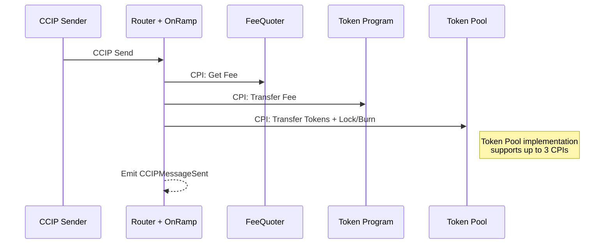
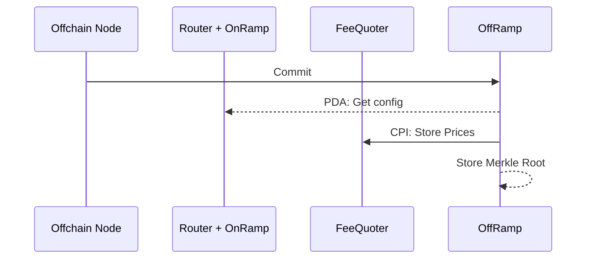
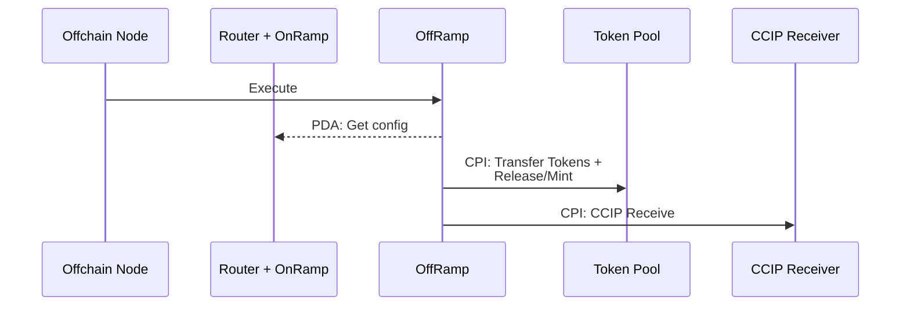

CCIP Send Flow

```mermaid
sequenceDiagram
    participant U as CCIP Sender
    participant R as Router + OnRamp
    participant F as FeeQuoter
    participant TP as Token Program
    participant T as Token Pool

    U->>R: CCIP Send
    R->>F: CPI: Get Fee
    R->>TP: CPI: Transfer Fee
    R->>T: CPI: Transfer Tokens + Lock/Burn
    Note right of T: Token Pool implementation<br/>supports up to 3 CPIs
    R-->>R: Emit CCIPMessageSent
```

Commit Flow

```mermaid
sequenceDiagram
    participant N as Offchain Node
    participant R as Router + OnRamp
    participant F as FeeQuoter
    participant O as OffRamp

    N->>O: Commit
    O-->>R: PDA: Get config
    O->>F: CPI: Store Prices
    O-->>O: Store Merkle Root
```

Execute Flow

```mermaid
sequenceDiagram
    participant N as Offchain Node
    participant R as Router + OnRamp
    participant O as OffRamp
    participant T as Token Pool
    participant C as CCIP Receiver

    N->>O: Execute
    O-->>R: PDA: Get config
    O->>T: CPI: Transfer Tokens +<br/>Release/Mint
    O->>C: CPI: CCIP Receive
```

