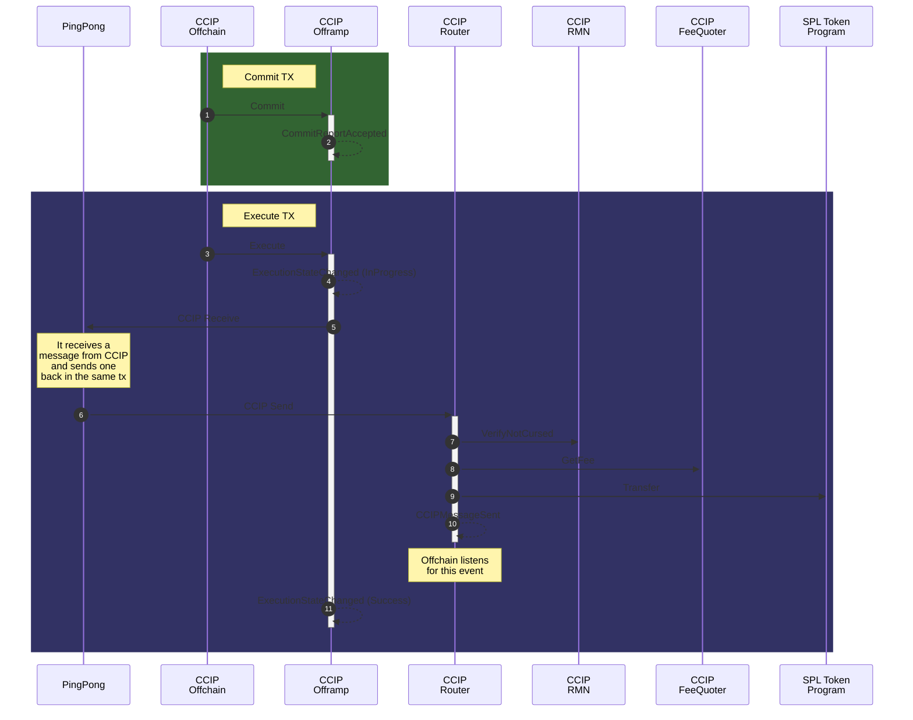

# Sequence diagram of ping pong

```mermaid
sequenceDiagram
    autonumber
    participant PingPong as PingPong
    participant Offchain as CCIP<br>Offchain
    participant Offramp as CCIP<br>Offramp
    participant Router as CCIP<br>Router
    participant RMN as CCIP<br>RMN
    participant FeeQuoter as CCIP<br>FeeQuoter
    participant Token as SPL Token<br>Program
    rect rgb(50,100,50)
    Note right of Offchain: Commit TX
        Offchain ->>+ Offramp: Commit
        Offramp -->>- Offramp: CommitReportAccepted
    end

    rect rgb(50,50,100)
    Note right of Offchain: Execute TX
        Offchain ->>+ Offramp: Execute
        Offramp -->> Offramp: ExecutionStateChanged (InProgress)
        Offramp ->>+ PingPong: CCIP Receive
        Note over PingPong: It receives a<br>message from CCIP<br>and sends one<br>back in the same tx
        PingPong ->>+ Router: CCIP Send
        Router ->> RMN: VerifyNotCursed
        Router ->>+ FeeQuoter: GetFee
        Router ->> Token: Transfer
        Router -->>- Router: CCIPMessageSent
        Note over Router: Offchain listens <br>for this event
        Offramp -->>- Offramp: ExecutionStateChanged (Success)
    end
```
