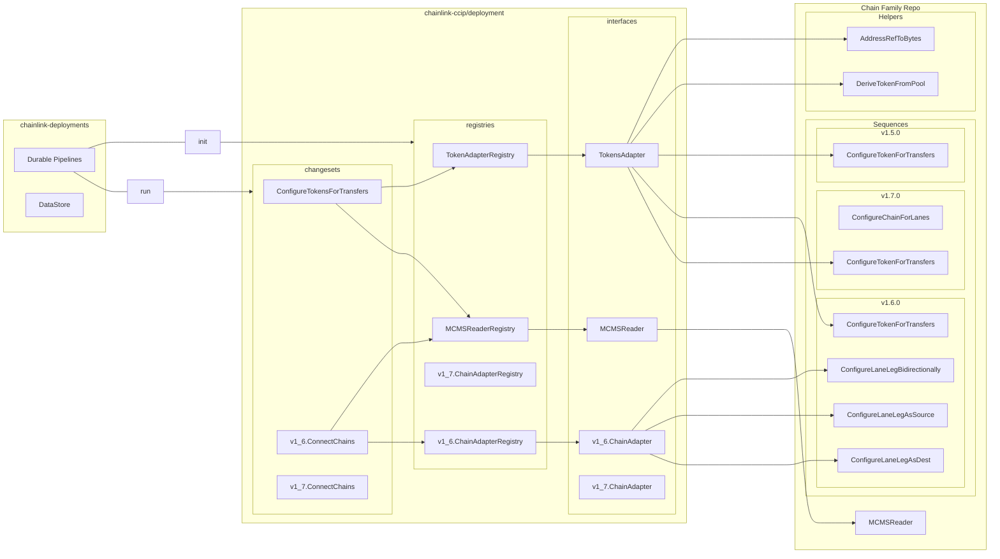

# CCIP Deployments

CCIP deployments often target multiple chain families (and product versions, in the case of token pools). Each of these deployment stories have a singular changeset capable of interfacing with different logic per chain family. This document describes how these changesets are designed, how to run them, and how to extend support to new chain families.

## Design

This diagram provides an overview of all components and their locations.



## Usage

Within the `PipelinesRegistryProvider.Init()` function in `chainlink-deployments/domains/<CCIP_DOMAIN>/<ENVIRONMENT>/pipelines.go`, you simply need to construct the required registries and initialize the changesets with them. Your pipelines are then ready for execution. For the most up-to-date information on how to execute a durable pipeline, see the [official documentation](https://docs.cld.cldev.sh/guides/pipelines/).

```golang
// NOTE: This is still example code - types are not guaranteed to exist as described here.
// TODO: Update when types and names are solidified.

mcmsReg := changesets.NewMCMSReaderRegistry()
mcmsReg.RegisterMCMSReader("evm", evm.MCMSReader{})
mcmsReg.RegisterMCMSReader("solana", solana.MCMSReader{})

tokenAdapterReg := tokens.NewTokenAdapterRegistry()
tokenAdapterReg.RegisterTokenAdapter("evm", semver.MustParse("1.7.0"), evm1_7_0.TokenAdapter{})
tokenAdapterReg.RegisterTokenAdapter("evm", semver.MustParse("1.5.1"), evm1_5_1.TokenAdapter{})
tokenAdapterReg.RegisterTokenAdapter("solana", semver.MustParse("1.6.2"), solana1_6_2.TokenAdapter{})

// We would have a separate chain adapter registry for v1_7_0.
// We only have a single adapter registry for tokens because tokens must be backwards compatible.
// You must be able to connect any token pool version to any other token pool version.
chainAdapterReg1_6_0 := chains1_6_0.NewChainAdapterRegistry()
chainAdapterReg1_6_0.RegisterChainAdapter("evm", evm1_6_0.ChainAdapter{})
chainAdapterReg1_6_0.RegisterChainAdapter("solana", solana1_6_0.ChainAdapter{})

registry.Add("configure-tokens-for-transfers",
		changeset.Configure(tokens.ConfigureTokensForTransfers(mcmsReg, tokenAdapterReg)).WithEnvInput())

registry.Add("connect-chains-v1_6_0",
		changeset.Configure(chains1_6_0.ConnectChains(mcmsReg, chainAdapterReg1_6_0)).WithEnvInput())
```

## New Chain Families

To implement a new chain family, implement each adapter. i.e.

- MCMSReader
- TokensAdapter (1 for each token pool version supported on the family)
- All ChainAdapters that must be supported by the family

Then, simply register your adapters in `chainlink-deployments/domains/<CCIP_DOMAIN>/<ENVIRONMENT>/pipelines.go`.
