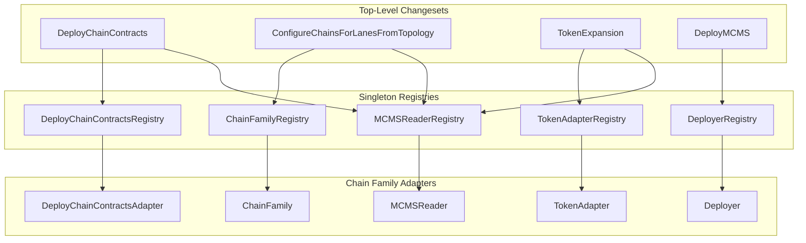
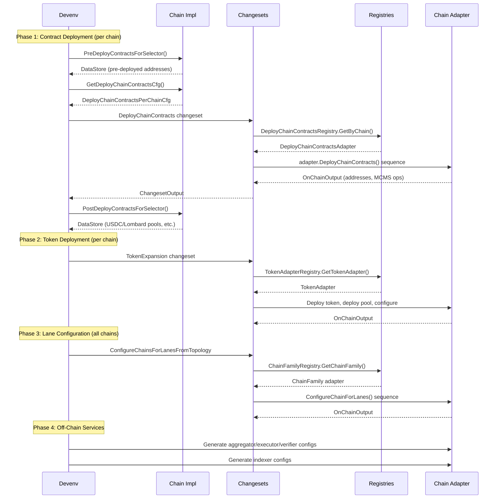

# CCIP 2.0 Integration Guide

This guide is for teams adding a new chain family to CCIP 2.0. It covers the interfaces you must implement, how the deployment flow works, and how to wire your adapters into the system for both local development (CCV devenv) and production operations (chainlink-deployments pipelines).

For the version-agnostic architecture and shared interface catalog, see [Architecture](architecture.md) and [Interfaces](interfaces.md). For the general step-by-step adapter implementation guide (1.6-oriented), see [Implementing Adapters](implementing-adapters.md).

## Prerequisites

- Familiarity with the [Architecture](architecture.md) (adapter-registry pattern, operations-sequences-changesets hierarchy)
- The `chain-selectors` library must already define a family constant for your chain (e.g., `chain_selectors.FamilyCanton`)
- Smart contracts for your chain family are deployed or in development

## How 2.0 Differs from 1.6

CCIP 2.0 introduces several architectural changes that affect how chain families integrate:

| Concept | 1.6 | 2.0 |
|---------|-----|-----|
| **Execution** | Implicit (part of OffRamp) | Explicit Executor contracts with qualifiers |
| **OCR** | OCR3 configured on OffRamp | No OCR -- off-chain consensus handled differently |
| **Lane Configuration** | Per-leg: `ConfigureLaneLegAsSource` / `ConfigureLaneLegAsDest` | Per-chain: `ConfigureChainForLanes` (holistic) |
| **Contract Deployment** | `Deployer.DeployChainContracts()` via `DeployerRegistry` | `DeployChainContractsAdapter.DeployChainContracts()` via `DeployChainContractsRegistry` |
| **Lane Adapter** | `LaneAdapter` (required) | `ChainFamily` (replaces LaneAdapter) |
| **Token Pools** | CCV not supported | CCV (Cross-Chain Verifiers), allowed finality, lockbox for L/R |
| **Fee Configuration** | FeeQuoter only | FeeQuoter + per-pool token transfer fees |

## Architecture: 2.0 Dispatch Flow



## Tooling API Interfaces

Interfaces are organized into three tiers based on what a 2.0-only chain family needs.

### Tier 1: 2.0-Specific Interfaces

These are the primary interfaces for 2.0. They live in `deployment/v2_0_0/adapters/` and have no 1.6 equivalent.

#### DeployChainContractsAdapter

**Source:** [v2_0_0/adapters/deploy_chain_contracts.go](../v2_0_0/adapters/deploy_chain_contracts.go)
**Registry:** `DeployChainContractsRegistry` via `adapters.GetDeployChainContractsRegistry()`
**Key:** `chainFamily` (version-agnostic within 2.0)

Deploys all 2.0 CCIP contracts for a chain: Router, OnRamp, OffRamp, FeeQuoter, CommitteeVerifier(s), Executor(s), Proxy, and RMNRemote (RMN is retained in 2.0 for curse/uncurse).

This **replaces** `Deployer.DeployChainContracts()` which is the 1.6 deployment path. The 2.0 changeset dispatches through `DeployChainContractsRegistry`, not `DeployerRegistry`.

```go
type DeployChainContractsAdapter interface {
    SetContractParamsFromImportedConfig() *Sequence[DeployChainConfigCreatorInput, DeployContractParams, BlockChains]
    DeployChainContracts() *Sequence[DeployChainContractsInput, OnChainOutput, BlockChains]
}
```

**Registration:**
```go
adapters.GetDeployChainContractsRegistry().Register(chainsel.FamilyMyChain, &MyDeployAdapter{})
```

#### ChainFamily

**Source:** [v2_0_0/adapters/chain_family.go](../v2_0_0/adapters/chain_family.go)
**Registry:** `ChainFamilyRegistry` via `adapters.GetChainFamilyRegistry()`
**Key:** `chainFamily` (version-agnostic within 2.0)

Handles chain-centric lane configuration. Unlike the 1.6 `LaneAdapter` which configures lanes per-leg (source vs dest separately), `ChainFamily` configures everything for a chain in one shot: committee verifiers, executors, FeeQuoter dest configs, and the full remote chain map.

This **replaces** `LaneAdapter` for 2.0. New chain families do not need to implement `LaneAdapter`.

```go
type ChainFamily interface {
    ConfigureChainForLanes() *Sequence[ConfigureChainForLanesInput, OnChainOutput, BlockChains]
    AddressRefToBytes(ref datastore.AddressRef) ([]byte, error)
    GetOnRampAddress(ds datastore.DataStore, chainSelector uint64) ([]byte, error)
    GetOffRampAddress(ds datastore.DataStore, chainSelector uint64) ([]byte, error)
    GetFQAddress(ds datastore.DataStore, chainSelector uint64) ([]byte, error)
    GetRouterAddress(ds datastore.DataStore, chainSelector uint64) ([]byte, error)
    GetTestRouter(ds datastore.DataStore, chainSelector uint64) ([]byte, error)
    ResolveExecutor(ds datastore.DataStore, chainSelector uint64, qualifier string) (string, error)
}
```

**Registration:**
```go
adapters.GetChainFamilyRegistry().RegisterChainFamily(chainsel.FamilyMyChain, &MyChainFamilyAdapter{})
```

#### Off-Chain Service Config Adapters

These adapters resolve chain-specific contract addresses for off-chain service job configuration (verifiers, executors, aggregators, indexers). They are required when your chain participates in the full CCV off-chain stack.

| Interface | Registry Accessor | Purpose |
|-----------|-------------------|---------|
| `VerifierConfigAdapter` | `GetVerifierJobConfigRegistry()` | Resolve addresses for verifier job TOML |
| `ExecutorConfigAdapter` | `GetExecutorConfigRegistry()` | Resolve addresses for executor job TOML |
| `IndexerConfigAdapter` | `GetIndexerConfigRegistry()` | Resolve verifier addresses for indexer config |
| `AggregatorConfigAdapter` | `GetAggregatorConfigRegistry()` | Scan committee states for aggregator offchain config |
| `CommitteeVerifierContractAdapter` | `GetCommitteeVerifierContractRegistry()` | Resolve committee verifier contract refs from datastore |
| `TokenVerifierConfigAdapter` | `GetTokenVerifierConfigRegistry()` | Resolve addresses for token verifier (CCTP/Lombard) jobs |

All are keyed by `chainFamily` (no version) and registered via `Register(family, adapter)`.

### Tier 2: Shared Infrastructure Interfaces

These are version-agnostic and documented in [Interfaces Reference](interfaces.md). They are still required for 2.0.

#### Deployer (MCMS only)

**Source:** [deploy/product.go](../deploy/product.go)

For 2.0, the `Deployer` interface is needed for MCMS governance operations only. Its `DeployChainContracts()` method is the 1.6 path -- use `DeployChainContractsAdapter` instead. Note that `SetOCR3Config()` is a 1.6 concept and is not used in 2.0.

EVM 2.0 reuses the 1.6 `EVMAdapter` struct for these shared methods since MCMS is not version-specific:

```go
deploy.GetRegistry().RegisterDeployer(chainsel.FamilyEVM, semver.MustParse("2.0.0"), &evmseqV1_6.EVMAdapter{})
```

Methods you must implement:
- `DeployMCMS()` -- deploy Multi-Chain Multi-Sig governance contracts
- `FinalizeDeployMCMS()` -- post-deploy MCMS initialization (can no-op)
- `GrantAdminRoleToTimelock()` -- grant admin between timelocks
- `UpdateMCMSConfig()` -- update MCMS signer/config on-chain

Methods you can skip for 2.0:
- `SetOCR3Config()` -- 1.6 only, not used in 2.0

#### TokenAdapter

**Source:** [tokens/product.go](../tokens/product.go)

Register one adapter per pool version your chain supports. For example, EVM registers adapters for versions 1.5.1, 1.6.1, and 2.0.0. See [Interfaces Reference](interfaces.md#tokenadapter) for the full method list.

#### Other Shared Interfaces

| Interface | Source | Notes |
|-----------|--------|-------|
| `FeeAdapter` | [fees/product.go](../fees/product.go) | Token transfer fee management |
| `FeeAggregatorAdapter` | [fees/fee_aggregator.go](../fees/fee_aggregator.go) | Set/get fee aggregator address. 2.0 dispatches to multiple contracts (OnRamp, Proxy, Executor) |
| `MCMSReader` | [utils/changesets/output.go](../utils/changesets/output.go) | Resolve MCMS metadata. One per family (no version) |
| `TransferOwnershipAdapter` | [deploy/product.go](../deploy/product.go) | Ownership transfer via MCMS proposals |
| `CurseAdapter` / `CurseSubjectAdapter` | [fastcurse/product.go](../fastcurse/product.go) | RMN curse/uncurse operations |

### Tier 3: Legacy and Optional Interfaces

#### LaneAdapter (not needed for 2.0)

**Source:** [lanes/product.go](../lanes/product.go)

`LaneAdapter` is the 1.6 per-leg lane configuration interface. New chain families integrating for 2.0 only do not need to implement it. EVM 2.0 still registers one for backward compatibility with the legacy `ConnectChains` devenv toggle, but it is not used in the canonical 2.0 flow.

#### Specialized Token Integrations

| Interface | Source | When Needed |
|-----------|--------|-------------|
| `CCTPChain` / `RemoteCCTPChain` | [v2_0_0/adapters/cctp.go](../v2_0_0/adapters/cctp.go) | Only if your chain supports USDC via CCTP |
| `LombardChain` / `RemoteLombardChain` | [v2_0_0/adapters/lombard.go](../v2_0_0/adapters/lombard.go) | Only if your chain supports Lombard |

## CCV Devenv Interfaces

For local development and e2e testing, chain families implement interfaces in `chainlink-ccv/build/devenv/cciptestinterfaces/`. These are separate from the tooling API and drive the devenv environment setup.

### CCIP17Configuration

The top-level devenv interface combines `OnChainConfigurable` and `OffChainConfigurable`:

```go
type CCIP17Configuration interface {
    OnChainConfigurable
    OffChainConfigurable
}
```

### OnChainConfigurable

Defines the contract deployment and lane configuration hooks. The devenv calls a shared `DeployContractsForSelector` function that orchestrates pre-deploy, the tooling API changeset, and post-deploy:

```go
type OnChainConfigurable interface {
    ChainFamily() string

    // Pre/post hooks around the common DeployChainContracts changeset
    PreDeployContractsForSelector(ctx, env, selector, topology) (DataStore, error)
    GetDeployChainContractsCfg(env, selector, topology) (DeployChainContractsPerChainCfg, error)
    PostDeployContractsForSelector(ctx, env, selector, topology) (DataStore, error)

    // Lane topology configuration
    GetConnectionProfile(env, selector) (ChainDefinition, CommitteeVerifierRemoteChainInput, error)
    GetChainLaneProfile(env, selector) (ChainLaneProfile, error)

    // Post-lane-connection work (e.g. USDC/Lombard config, custom executor wiring)
    PostConnect(env, selector, remoteSelectors) error
}
```

**How it works:**

1. `PreDeployContractsForSelector` runs chain-specific pre-deploy (e.g. deploying a CREATE2 factory on EVM). The returned DataStore is merged into `env.DataStore`.
2. `GetDeployChainContractsCfg` returns per-chain config. This is passed to the tooling API `DeployChainContracts` changeset.
3. `PostDeployContractsForSelector` runs chain-specific post-deploy (e.g. deploying USDC/Lombard pools).
4. `GetChainLaneProfile` returns lane topology data that feeds `ConfigureChainsForLanesFromTopology`.
5. `PostConnect` runs after all chains are connected.

### OffChainConfigurable

Handles local infrastructure, CL node configuration, and funding:

```go
type OffChainConfigurable interface {
    DeployLocalNetwork(ctx, bcs) (*blockchain.Output, error)
    ConfigureNodes(ctx, blockchain) (string, error)
    FundNodes(ctx, cls, bc, linkAmount, nativeAmount) error
    FundAddresses(ctx, bc, addresses, nativeAmount) error
}
```

### TokenConfigProvider (optional)

Implement this if your chain supports token pools. When absent, token deployment and `ConfigureTokensForTransfers` are skipped for that chain.

```go
type TokenConfigProvider interface {
    GetSupportedPools() []PoolCapability
    GetTokenExpansionConfigs(env, selector, combos) ([]TokenExpansionInputPerChain, error)
    PostTokenDeploy(env, selector, deployedRefs) error
    GetTokenTransferConfigs(env, selector, remoteSelectors, topology) ([]TokenTransferConfig, error)
}
```

- `GetSupportedPools` declares what pool types and versions this chain can deploy (e.g. BurnMint 2.0.0, LockRelease 2.0.0).
- `GetTokenExpansionConfigs` generates `TokenExpansionInputPerChain` entries from pre-computed token combinations.
- `PostTokenDeploy` runs after TokenExpansion (e.g. funding lock-release pools).
- `GetTokenTransferConfigs` builds cross-chain transfer configs for `ConfigureTokensForTransfers`.

### ImplFactory

Registered via `RegisterImplFactory(family, factory)`. Provides topology enrichment, executor key generation, funding support checks, and bootstrap executor behavior.

### Chain

The runtime messaging interface for e2e tests: `SendMessage`, `WaitOneSentEventBySeqNo`, `WaitOneExecEventBySeqNo`, `GetTokenBalance`, `Curse`/`Uncurse`, etc. See the full definition in `cciptestinterfaces/interface.go`.

## Directory Layout

Follow this canonical layout for a 2.0 chain family:

```
chains/<family>/deployment/
├── go.mod
├── go.sum
├── utils/                          # Shared utilities
│   ├── common.go                   # Contract type constants
│   ├── deploy.go                   # Deployment helpers
│   └── datastore.go                # DataStore helpers
├── v1_0_0/                         # Version-agnostic token operations
│   └── sequences/
│       ├── token.go                # DeployToken, DeriveTokenAddress, etc.
│       └── init.go
├── v2_0_0/                         # 2.0-specific implementation
│   ├── adapters/
│   │   └── init.go                 # All init() registrations
│   ├── operations/                 # Low-level contract operations
│   │   ├── committee_verifier/
│   │   ├── executor/
│   │   ├── fee_quoter/
│   │   ├── offramp/
│   │   ├── onramp/
│   │   ├── router/
│   │   └── token_pools/
│   └── sequences/                  # High-level operation orchestration
│       ├── deploy_chain_contracts.go
│       ├── configure_chain_for_lanes.go
│       ├── tokens/                 # Per-version token pool sequences
│       └── mcms.go
└── docs/                           # Chain-specific documentation
```

## Registration via init()

Create `init()` functions that run automatically when your package is imported. Here is the complete registration checklist for a 2.0 chain family, modeled after the EVM implementation:

```go
// chains/<family>/deployment/v2_0_0/adapters/init.go
package adapters

func init() {
    v := semver.MustParse("2.0.0")

    // --- Tier 1: 2.0-specific registrations ---

    // Deploy chain contracts (replaces Deployer.DeployChainContracts for 2.0)
    ccvadapters.GetDeployChainContractsRegistry().Register(
        chainsel.FamilyMyChain, &MyDeployChainContractsAdapter{},
    )

    // Chain family (replaces LaneAdapter for 2.0)
    ccvadapters.GetChainFamilyRegistry().RegisterChainFamily(
        chainsel.FamilyMyChain, &MyChainFamilyAdapter{},
    )

    // Off-chain service config adapters
    ccvadapters.GetCommitteeVerifierContractRegistry().Register(chainsel.FamilyMyChain, &MyCommitteeVerifierAdapter{})
    ccvadapters.GetExecutorConfigRegistry().Register(chainsel.FamilyMyChain, &MyExecutorConfigAdapter{})
    ccvadapters.GetVerifierJobConfigRegistry().Register(chainsel.FamilyMyChain, &MyVerifierConfigAdapter{})
    ccvadapters.GetIndexerConfigRegistry().Register(chainsel.FamilyMyChain, &MyIndexerConfigAdapter{})
    ccvadapters.GetAggregatorConfigRegistry().Register(chainsel.FamilyMyChain, &MyAggregatorConfigAdapter{})
    ccvadapters.GetTokenVerifierConfigRegistry().Register(chainsel.FamilyMyChain, &MyTokenVerifierConfigAdapter{})

    // --- Tier 2: Shared infrastructure registrations ---

    // Deployer (for MCMS only -- can reuse a shared adapter struct)
    deploy.GetRegistry().RegisterDeployer(chainsel.FamilyMyChain, v, &MyMCMSAdapter{})

    // MCMS Reader
    changesets.GetRegistry().RegisterMCMSReader(chainsel.FamilyMyChain, &MyMCMSAdapter{})

    // Transfer ownership
    deploy.GetTransferOwnershipRegistry().RegisterAdapter(chainsel.FamilyMyChain, v, &MyMCMSAdapter{})

    // Token adapter (register per pool version)
    tokens.GetTokenAdapterRegistry().RegisterTokenAdapter(chainsel.FamilyMyChain, v, &MyTokenAdapter{})

    // Fee adapters
    fees.GetRegistry().RegisterFeeAdapter(chainsel.FamilyMyChain, v, &MyFeeAdapter{})
    fees.GetFeeAggregatorRegistry().RegisterFeeAggregatorAdapter(chainsel.FamilyMyChain, v, &MyFeeAggregatorAdapter{})

    // Curse adapter
    fastcurse.GetCurseRegistry().RegisterNewCurse(fastcurse.CurseRegistryInput{
        CursingFamily:       chainsel.FamilyMyChain,
        CursingVersion:      v,
        CurseAdapter:        &MyCurseAdapter{},
        CurseSubjectAdapter: &MyCurseAdapter{},
    })
}
```

### Wiring into chainlink-deployments

In `chainlink-deployments/domains/ccv/pkg/pipelines/shared.go`, add a blank import to trigger your `init()`:

```go
import (
    _ "github.com/smartcontractkit/chainlink-ccip/chains/mychain/deployment/v2_0_0/adapters"
)
```

## Deployment Flow Walkthrough

This is the sequence of events when devenv (or a production pipeline) sets up a 2.0 chain:



### Phase 1: Contract Deployment

For each chain selector, the shared `DeployContractsForSelector` function in `implcommon.go`:

1. Calls `impl.PreDeployContractsForSelector()` -- chain-specific pre-deploy work (e.g. CREATE2 factory on EVM). Returned DataStore is merged into `env.DataStore`.
2. Calls `impl.GetDeployChainContractsCfg()` -- returns per-chain config (executor params, FQ params, committee verifier params from topology).
3. Invokes `v2_0_0/changesets.DeployChainContracts(registry)` -- the changeset looks up the `DeployChainContractsAdapter` by chain family, builds committee verifier params from topology, and executes the adapter's `DeployChainContracts()` sequence.
4. Calls `impl.PostDeployContractsForSelector()` -- chain-specific post-deploy (e.g. USDC/Lombard pool deployment on EVM). The returned DataStore is merged.

### Phase 2: Token Deployment

For each chain that implements `TokenConfigProvider`:

1. `GetTokenExpansionConfigs()` generates `TokenExpansionInputPerChain` entries.
2. `TokenExpansion` changeset deploys tokens, pools, and optionally configures cross-chain transfers.
3. `PostTokenDeploy()` runs chain-specific work (e.g. funding lock-release pools).
4. `ConfigureTokensForTransfers` configures cross-chain transfer settings using `GetTokenTransferConfigs()`.

### Phase 3: Lane Configuration

The canonical 2.0 flow uses `ConfigureChainsForLanesFromTopology`:

1. Each chain's `GetChainLaneProfile()` provides lane topology data.
2. Devenv assembles `PartialChainConfig` entries with remote chain configs, committee verifier settings, executor qualifiers, and FQ dest configs.
3. The changeset resolves contract addresses from the DataStore via the `ChainFamily` adapter's address helpers.
4. Executes `ConfigureChainForLanes()` per chain -- this configures router, ramps, FQ, committee verifiers, and executor in one atomic sequence.

### Phase 4: Off-Chain Services

After on-chain deployment, devenv generates job configurations:
- **Aggregator config** via `AggregatorConfigAdapter` (committee states, verifier addresses)
- **Executor config** via `ExecutorConfigAdapter` (OffRamp, RMN, ExecutorProxy addresses)
- **Verifier config** via `VerifierConfigAdapter` (committee verifier, OnRamp, RMN addresses)
- **Indexer config** via `IndexerConfigAdapter` (verifier addresses by kind)

## TokenExpansion

`TokenExpansion` is the universal, chain-agnostic changeset for deploying and configuring tokens and token pools. It handles multiple scenarios in a single call.

**Source:** [tokens/token_expansion.go](../tokens/token_expansion.go)

### Capabilities

| Scenario | How |
|----------|-----|
| Deploy fresh token + pool | Set both `DeployTokenInput` and `DeployTokenPoolInput` |
| Deploy pool for existing token | Set only `DeployTokenPoolInput` with a `TokenRef` pointing to the existing token |
| CCT upgrade (existing pool to v2) | Use `ConfigureTokensForTransfers` with existing pool refs -- handles TAR registration, remote chain config, rate limits |
| Lockbox for Lock/Release | Automatic -- when deploying an L/R pool on 2.0, the lockbox is deployed as part of the pool deployment sequence |
| Rate limits | Set via `TokenTransferConfig.InboundRateLimiterConfig` / `OutboundRateLimiterConfig` |
| FTF (Fast Transfer Finality) | Set `TokenTransferConfig.AllowedFinalityConfig` for custom block confirmation rate limits |
| Skip ownership transfer | Set `SkipOwnershipTransfer: true` on per-chain input |

### Key Input Types

```go
type TokenExpansionInput struct {
    TokenExpansionInputPerChain map[uint64]TokenExpansionInputPerChain
    ChainAdapterVersion         *semver.Version
    MCMS                        mcms.Input
}

type TokenExpansionInputPerChain struct {
    TokenPoolVersion      *semver.Version
    DeployTokenInput      *DeployTokenInput      // nil = token already exists
    DeployTokenPoolInput  *DeployTokenPoolInput   // nil = pool already exists
    TokenTransferConfig   *TokenTransferConfig    // nil = skip transfer config
    SkipOwnershipTransfer bool
}

type DeployTokenPoolInput struct {
    TokenRef                         *datastore.AddressRef
    TokenPoolQualifier               string
    PoolType                         string          // "BurnMint", "LockRelease", etc.
    TokenPoolVersion                 *semver.Version
    Allowlist                        []string
    ThresholdAmountForAdditionalCCVs string          // 2.0 only: CCV threshold
    // ... additional fields
}
```

### How It Dispatches

TokenExpansion uses the `TokenAdapterRegistry` to find the right adapter for each chain family and pool version:

1. Looks up `TokenAdapter` by `(chainFamily, tokenPoolVersion)`
2. If `DeployTokenInput` is set, runs `adapter.DeployToken()`
3. If `DeployTokenPoolInput` is set, runs `adapter.DeployTokenPoolForToken()`
4. If `TokenTransferConfig` is set, runs `adapter.ConfigureTokenForTransfersSequence()`
5. Runs `adapter.UpdateAuthorities()` to transfer ownership to timelock (unless skipped)

## Operational Pipelines

For production, changesets are registered as named durable pipelines in `chainlink-deployments/domains/ccv/pkg/pipelines/shared.go`. These pipelines bind changesets with configuration resolvers and can be executed via CLI or automation.

### Available Pipelines

| Pipeline ID | Changeset | Purpose |
|-------------|-----------|---------|
| `deploy-chain-contracts-from-topology` | `DeployChainContracts` | Deploy 2.0 contracts from topology |
| `configure-chains-for-lanes-from-topology` | `ConfigureChainsForLanesFromTopology` | Lane + committee verifier wiring |
| `configure-tokens-for-transfers` | `ConfigureTokensForTransfers` | Cross-chain token transfer config |
| `token_expansion_cross_family` | `TokenExpansion` | Token/pool deployment and config |
| `manual_registration_cross_family` | `ManualRegistration` | Manual token registration in TAR |
| `set_token_pool_rate_limits_cross_family` | `SetTokenPoolRateLimits` | Rate limits on token pools |
| `set_token_transfer_fee_cross_family` | `SetTokenTransferFee` | Token transfer fees |
| `set_fee_aggregator_cross_family` | `SetFeeAggregator` | Fee aggregator updates |
| `update_fee_quoter_dests_cross_family` | `UpdateFeeQuoterDests` | FeeQuoter destination chain config |
| `set_token_pool_token_transfer_fee_cross_family` | `SetTokenPoolTokenTransferFee` | Pool-specific transfer fee config |

### Service Config Pipelines

| Pipeline ID | Purpose |
|-------------|---------|
| `generate-aggregator-config` | Aggregator committee config from on-chain state |
| `generate-indexer-config` | Indexer config from environment input |
| `apply-verifier-config` | Verifier job TOML from topology |
| `apply-executor-config` | Executor job TOML from topology |

Each pipeline uses the adapter registries, so once your chain family's `init()` is imported, the pipelines automatically discover and dispatch to your adapters.

## Reference Implementations

| Chain | Location | Key Patterns |
|-------|----------|--------------|
| **EVM 2.0** | `chains/evm/deployment/v2_0_0/` | Canonical 2.0 reference: full adapter set, multi-version token adapters (1.5.1, 1.6.1, 2.0.0), reuses 1.6 `EVMAdapter` for MCMS |
| **EVM CCV Devenv** | `chainlink-ccv/build/devenv/evm/` | `OnChainConfigurable` + `TokenConfigProvider` implementation, `ImplFactory` registration |
| **Solana 1.6** | `chains/solana/deployment/v1_6_0/` | Stateful adapter (caches timelock addresses), two-phase MCMS, PDA-based address derivation. Useful as a non-EVM reference even though it's 1.6 |

### EVM 2.0 init.go as a Template

The EVM 2.0 `init.go` at `chains/evm/deployment/v2_0_0/adapters/init.go` registers into every registry a 2.0 chain family needs. Use it as a checklist -- if EVM registers into a registry, your chain family likely needs to as well.

## Integration Checklist

Use this checklist to track your progress:

- [ ] Chain family constant defined in `chain-selectors`
- [ ] Go module created at `chains/<family>/deployment/`
- [ ] **Tier 1 (2.0-specific)**
  - [ ] `DeployChainContractsAdapter` -- deploy 2.0 contracts
  - [ ] `ChainFamily` -- lane configuration + address resolution
  - [ ] `VerifierConfigAdapter` -- verifier job addresses
  - [ ] `ExecutorConfigAdapter` -- executor job addresses
  - [ ] `IndexerConfigAdapter` -- indexer verifier addresses
  - [ ] `AggregatorConfigAdapter` -- committee state scanning
  - [ ] `CommitteeVerifierContractAdapter` -- committee verifier refs
  - [ ] `TokenVerifierConfigAdapter` -- token verifier addresses
- [ ] **Tier 2 (shared infrastructure)**
  - [ ] `Deployer` (MCMS methods)
  - [ ] `MCMSReader`
  - [ ] `TransferOwnershipAdapter`
  - [ ] `TokenAdapter` (per pool version)
  - [ ] `FeeAdapter`
  - [ ] `FeeAggregatorAdapter`
  - [ ] `CurseAdapter` / `CurseSubjectAdapter`
- [ ] **Registration**
  - [ ] `init()` function registers all adapters
  - [ ] Blank import in `chainlink-deployments` pipelines
- [ ] **CCV Devenv** (if participating in local e2e)
  - [ ] `OnChainConfigurable` implementation
  - [ ] `OffChainConfigurable` implementation
  - [ ] `TokenConfigProvider` (if supporting tokens)
  - [ ] `ImplFactory` registered via `RegisterImplFactory`
  - [ ] `Chain` implementation for runtime testing
- [ ] **Testing**
  - [ ] In-memory integration tests via `TokenExpansion` scenarios
  - [ ] Devenv e2e smoke tests
