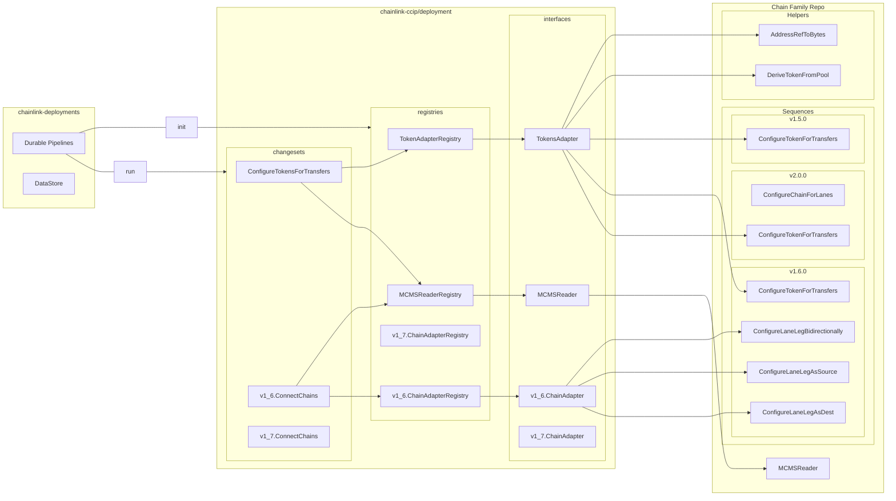

# CCIP Deployment Tooling API

The CCIP Deployment Tooling API provides a unified, strongly-typed Go-based operational layer for deploying, configuring, and managing CCIP across all chain families (EVM, Solana, Aptos, TON, Sui, etc.).

This shared library (`chainlink-ccip/deployment`) contains all generic, chain-agnostic types, registries, and utilities. Each chain family implements its own adapter alongside its contracts, either in `chainlink-ccip/chains/<chain>/deployment` or in a dedicated repository.

## Architecture Overview

## Three-Level Hierarchy

The API is structured in three levels of granularity:

| Level | Description | Use When |
|-------|-------------|----------|
| **Changesets** | Environment-aware entry points that read from DataStore, invoke sequences, and produce MCMS proposals | Executing operations via Durable Pipelines or full deployment environments |
| **Sequences** | Ordered collections of operations. Accept serializable input and minimal dependencies | Completing an operational workflow without a full deployment environment |
| **Operations** | Single side-effect actions (deploy, read, write). Produce reports for stateful retries | Making a single contract call or deployment |

## Package Layout

| Package | Purpose |
|---------|---------|
| `deploy/` | Contract deployment, MCMS deployment, OCR3 config, ownership transfer changesets and interfaces |
| `lanes/` | Lane configuration and inter-chain connection changesets and interfaces |
| `tokens/` | Token pool configuration, expansion, manual registration, rate limits |
| `fees/` | Fee configuration and token transfer fee management |
| `fastcurse/` | RMN curse/uncurse operations |
| `utils/changesets/` | `MCMSReader` interface, `OutputBuilder`, changeset utilities |
| `utils/sequences/` | `OnChainOutput` type, sequence execution utilities |
| `utils/mcms/` | MCMS input types |
| `utils/` | Common types, version constants, contract type constants |
| `testadapters/` | Test adapter framework for cross-chain message testing |

## Documentation

| Document | Description |
|----------|-------------|
| [Architecture](architecture.md) | Design principles, adapter-registry pattern, dispatch flow, DataStore and MCMS integration |
| [Interfaces](interfaces.md) | Complete API reference for all adapter interfaces and their registries |
| [Types](types.md) | All input/output types, config structs, and constants |
| [Changesets](changesets.md) | Reference for all changesets (entry points) with config types and usage |
| [Implementing Adapters](implementing-adapters.md) | Step-by-step guide for adding a new chain family |
| [MCMS and Utilities](mcms-and-utilities.md) | MCMS integration, `OutputBuilder`, DataStore and sequence utilities |

## Chain-Specific Documentation

| Chain Family | Documentation |
|-------------|---------------|
| EVM | [EVM Deployment Docs](../../chains/evm/deployment/docs/index.md) |
| Solana | [Solana Deployment Docs](../../chains/solana/deployment/docs/index.md) |
