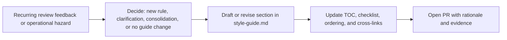

# Maintaining the Changeset Style Guide

This page explains when and how to update the [Changeset Style Guide](./style-guide.md). It does not restate the rules themselves; read the style guide for the actual guidance.

## Scope and purpose

The Changeset Style Guide turns recurring review feedback into a practical reference for writing and reviewing changesets.

This document explains how to maintain that guide so it stays useful, scannable, and reviewable over time. It is about maintaining the guide itself, not changeset implementation.

## When to add or update a rule

Good reasons to add or update a rule:

- The same feedback appears on multiple PRs.
- There is a real risk to correctness, safety, or operability that a short rule can prevent.
- A pattern is widespread enough that a durable principle, not just a one-line fix, is worth documenting.
- A current rule needs clarification because reviewers or authors are interpreting it inconsistently.

Signals to pause, narrow the scope, or avoid adding a rule:

- The issue is a one-off bug or a temporary API quirk that will disappear with the next refactor.
- The proposed rule would duplicate [Cross-Family Deployment Architecture](./architecture.md) or [Implementing Adapters](./implementing-adapters.md); prefer linking to those for deep implementation detail.
- The change would read as a mandate to rewrite unrelated, already-safe code. The style guide explicitly says it is not a mandate to rewrite older code that is correct and operating safely.
- The guidance is really a local implementation note, not a stable review principle.

## When to remove or consolidate a rule

Revise or remove a rule when:

- The underlying API, helper, or workflow has changed enough that the example now teaches the wrong instinct.
- Repo conventions have shifted and the old rule now conflicts with the default local pattern.
- Two sections now cover the same idea and can be merged into one clearer rule.
- The rule documents an edge case that no longer exists in practice.

When removing a rule, prefer either:

- folding the still-valid principle into a broader section, or
- deleting it entirely if the guidance is no longer useful.

Do not keep obsolete guidance only for historical continuity.

## Deciding between a new rule and expanding an existing one

Create a new section when the guidance introduces a distinct principle that could stand alone in review comments or the review checklist.

Expand an existing section when the change only adds:

- another example of the same failure mode,
- a small exception,
- a clarification of wording, or
- an additional repo convention that supports the same rule.

Keep each section focused on one rule or one closely related exception.

## How to write a rule

Match the structure used in the [Changeset Style Guide](./style-guide.md):

1. **`##` section title** — short, specific, and stable.
2. **Rule:** one clear sentence stating what to do or avoid.
3. **Why it matters:** explain the operational, correctness, review, or debugging impact.
4. **Examples:** use `// ❌ BAD:` and `// ✅ BETTER:` Go snippets when they make the pattern easier to recognize.
5. **Exceptions (optional):** if the rule is not universal, say when it does not apply.

When writing the **Rule:** line:

- Prefer direct verbs such as “Use”, “Resolve”, “Infer”, “Handle”, or “Avoid”.
- State the default behavior first.
- Keep it specific enough that a reviewer could quote it in one sentence.

When writing **Why it matters:**

- Focus on correctness, safety, operability, debuggability, or review clarity.
- Avoid repeating the rule in different words.

Examples should be updated when names, helpers, or APIs change, but example code does not need to be rewritten just to match every new local convention if the principle is still clear.

Use stable section titles. Avoid renaming existing `##` headings unless the old title is clearly misleading, because heading text determines link anchors used in reviews, docs, and PR discussions.

### Copyable rule template

Use this template when adding a new section to the style guide:

````md
## Short, Stable Section Title

**Rule:** State the default behavior in one clear sentence.

**Why it matters:** Explain the correctness, safety, operability, or review impact.

```go
// ❌ BAD: show the common mistake

// ✅ BETTER: show the preferred pattern
```
````

## Editorial standards

Keep contributions aligned with the tone and goals of the [Changeset Style Guide](./style-guide.md):

- Prefer durable principles over guidance tied to temporary implementation details.
- Prefer concrete BAD/BETTER examples when they make the rule faster to recognize.
- Keep sections short, scannable, and linkable.
- Split large topics into separate rules instead of growing one section indefinitely.
- Avoid duplicating deep implementation guidance that belongs in [Cross-Family Deployment Architecture](./architecture.md) or [Implementing Adapters](./implementing-adapters.md).
- Write for both human reviewers and AI-assisted authoring: the rule should be easy to quote, apply, and review against.

Match the main guide’s tone: direct, practical, and review-oriented. Prefer “what to do and why” over abstract documentation language.

## Required updates when editing the guide

When you add, remove, rename, split, or merge a rule in [Changeset Style Guide](./style-guide.md), also check the following:

- Update the **Table of Contents** so new sections appear and removed sections disappear.
- Update the **Review Checklist** so it matches the current rule set.
- Update any **cross-links** in this guide and related docs if section names or anchors changed.
- Check whether nearby examples should be revised for naming consistency or terminology changes.
- Place the rule where it fits the main guide’s conceptual flow. Preserve the existing section order unless there is a clear reason to reorganize it.

## Contribution process

1. Open a PR that updates [style-guide.md](./style-guide.md).
2. If this maintenance document needs new process guidance, update this file in the same PR.
3. In the PR description, state:
   - the rule being added, changed, merged, or removed,
   - the problem it addresses,
   - whether it reflects recurring review feedback, an incident, or a clarification of existing guidance,
   - any required updates to the checklist, table of contents, or cross-links.
4. For substantive new rules, include brief evidence in the PR description, such as recurring review feedback, an incident, or repeated confusion in authoring.
5. Request review from the owners for deployment and changeset tooling. If there is a CODEOWNERS entry or team-specific review convention for this area, follow that source of truth.

## Non-goals

This guide is not meant to:

- document every helper or package used in changesets,
- replace architecture or adapter implementation docs,
- preserve historical exceptions that are no longer useful,
- require cleanup of unrelated older code that is already safe and correct.

## Maintainer checklist

Before merging a style guide update, confirm the following:

- The rule describes a recurring pattern or meaningful operational risk.
- The guidance is framed as a durable principle, not a temporary implementation detail.
- The section title is specific and stable.
- The rule and rationale are concise.
- Examples are accurate and materially improve comprehension.
- Any required companion updates to the Table of Contents, Review Checklist, and cross-links have been made.
- For substantive new rules, the PR includes brief evidence that the guidance reflects a recurring theme or real risk.
- Cross-links and anchors still work.
- Related docs are linked instead of duplicated.

## Contribution flow at a glance


