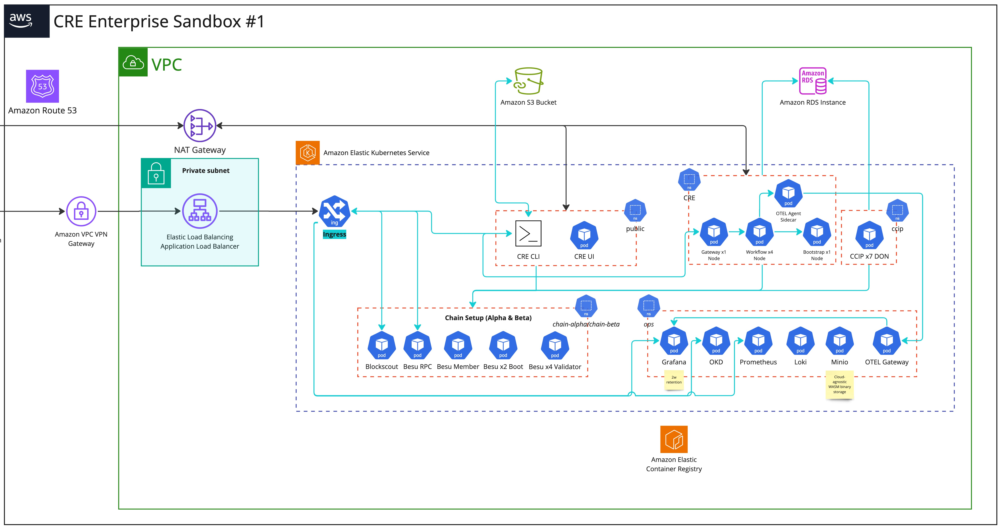

# CRE Enterprise Sandbox

The purpose of this deployment is to create sandbox environments for our customers.
It shouldn't be used by developers. If you are interested in CRE, please check the `deployments/cre` directory.

## Architecture

The high-level overview of the architecture of the CRE Enterprise Sandbox Infrastructure is shown in the following diagram.



## Deployment

**Important:** Before running any command, please be aware that the environment may be used by a customer, and redeploying components could delete existing data.

### Getting Started

To get started with the CRE Enterprise Sandbox, follow these steps to configure the repository and tools:

#### List of Existing Clusters

Below is a list of existing clusters that you can configure to interact with the CRE Enterprise Sandbox environment.

| Cluster Name | Configure kubectl Context | AWS Profile | Description |
|--------------|---------------------------|-------------|-------------|
| main-fwog    | `aws eks update-kubeconfig --name main-fwog --alias main-fwog --region us-west-2 --profile cre-admin` | [profile cre-admin] <br>sso_start_url = https://d-92674293d5.awsapps.com/start <br>sso_region = us-west-2 <br>sso_account_id = 273354650086 <br>sso_role_name = AdministratorAccess <br>region = us-west-2 | SWIFT environment |

### Steps to Set Up the Environment

Follow these steps to set up your environment and start working with the CRE Enterprise Sandbox:

1. **Clone the repository**:
  ```sh
  git clone git@github.com:smartcontractkit/crib.git
  ```

2. **Navigate to the CRE directory**:
  ```sh
  cd deployments/cre-enterprise-sandbox
  ```

3. **Configure the environment**:
  ```sh
  cp .env.main-fwog .env
  ```

4. **Enter the NIX shell**:
  ```sh
  nix develop
  ```

These steps will ensure that all necessary dependencies are managed and your environment is correctly set up.

### Blockchain

The CRE environment uses the Besu blockchain, and two chains named alpha and beta need to be deployed.
These chains should be deployed to the `chain-alpha` and `chain-beta` namespaces, respectively.

```sh
devspace run blockchain
```

If you prefer to deploy each chain independently, use:

```sh
devspace run chain-alpha
```

for the alpha chain and:

```sh
devspace run chain-beta
```

for the beta chain.

### CCIP DON

To deploy the Chainlink CCIP v1.6 DON which consist of (1 boot node / 4 nodes) with the Job Distributor, you can use the following commands:

- To deploy the infrastructure only:
  ```sh
  devspace run ccip-infra
  ```

#### Full Deploy with On chain state
- To deploy both the infrastructure and the on-chain deployments with ping-pong test:
  ```sh
  devspace run chainlink-ccip
  ```

#### On Chain State  
On Chain deployment will save the On Chain state in the `$TMP_DIR` dir.
In CRE it make sense to keep the state dir in git, so it can be used as input for executing transactions.

#### Re-deploying CCIP DON
For full redeploy you need to first purge ccip namespace and clean TMP_DIR.
```
devspace run purge-chainlink-ccip
```
After that you can run full deploy with `devspace run chainlink-ccip`

### CRE Workflow/Capability DON

To deploy the Chainlink CCIP v1.6 DON, which consists of 1 boot node, 1 gateway, and 4 nodes, use the following command:

```sh
devspace run cre
```

## Removing Components

Using the `devspace purge` command usually results in deleting the entire namespace. Instead, you may prefer to use the `uninstall` commands that only remove specific Helm releases.

To remove components, use the following command:

```sh
devspace run uninstall <component-name>
```

For example:

```sh
devspace run uninstall chain-alpha
```

Available components: `chain-alpha`, `chain-beta`, `ccip`, `cre`.

When you run the uninstall command, you will see output similar to the following:

```sh
devspace run uninstall
info Using namespace 'temp'
info Using kube context 'main-fwog'
Usage: devspace run-command uninstall <component>. Available components: chain-alpha, chain-beta, ccip, cre
```
