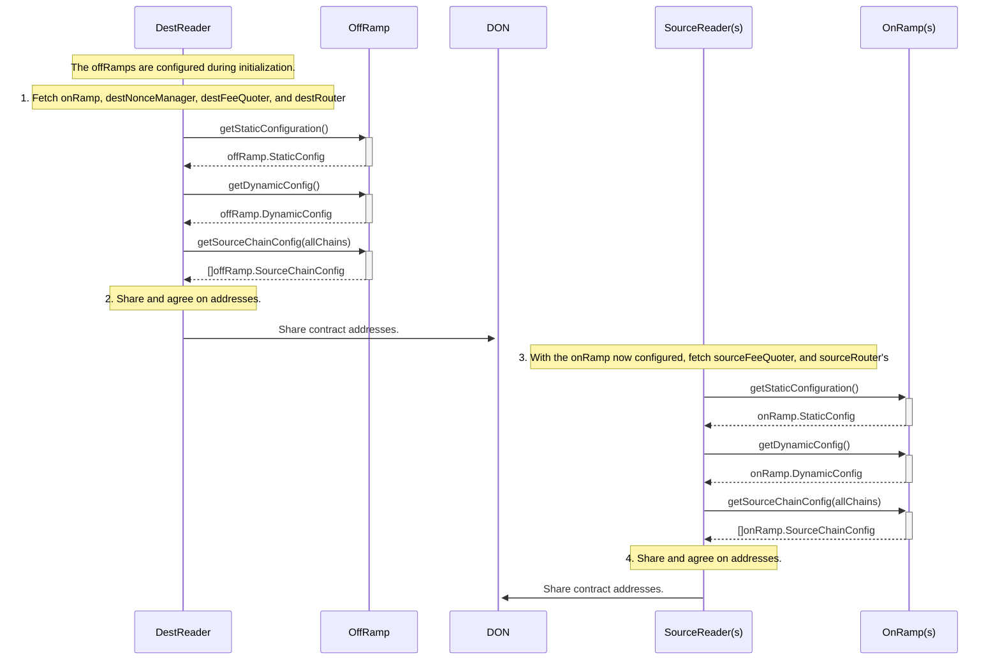

# Plugin Configuration

The OCR3 plugins have configuration is optimized to reduce the amount of
manual configuration required for node operators, and reduce the amount of
configuration needed when expanding the CCIP network. A blue-green deployment
pattern is also used to facilitate configuration changes. This document
describes the high level configuration along with the discovery process used to
run the system.

## Configuration Locations

Outline of the different locations where configuration is stored.

### Chainlink Node Job Specification

The Job Specification (jobspec) is per-node configuration. Updating this
requires coordination with node operators, so configurations are kept to a
minimum.

See the factory function inputs.

**Data structure references**:

* [NewPluginOracleCreator](https://github.com/smartcontractkit/chainlink/blob/1b41e69cca2f4622d367ef18733c36fcae433505/core/capabilities/ccip/oraclecreator/plugin.go#L77)

### Home Chain

This is a global location readable by all nodes which are part of the
Distributed Oracle Network (DON). A bare minimum of configuration required to
bootstrap the network are stored here in order to reduce the number of updates
needed when expanding the CCIP network.

Configuration includes per-chain configuration as well as DON participant
addresses.

**Data structure references**:

* [CCIPConfig](https://github.com/smartcontractkit/chainlink/blob/ad555baa323ef32c3c00882aaec134e44226e79d/contracts/src/v0.8/ccip/capability/CCIPHome.sol#L112-L125)
```solidity
  /// @notice OCR3 configuration.
  /// Note that FRoleDON >= fChain, since FRoleDON represents the role DON, and fChain represents sub-committees.
  /// FRoleDON values are typically identical across multiple OCR3 configs since the chains pertain to one role DON,
  /// but FRoleDON values can change across OCR3 configs to indicate role DON splits.
  struct OCR3Config {
    Internal.OCRPluginType pluginType; // ─╮ The plugin that the configuration is for.
    uint64 chainSelector; //               │ The (remote) chain that the configuration is for.
    uint8 FRoleDON; //                     │ The "big F" parameter for the role DON.
    uint64 offchainConfigVersion; // ──────╯ The version of the exec offchain configuration.
    bytes offrampAddress; // The remote chain offramp address.
    bytes rmnHomeAddress; // The home chain RMN home address.
    OCR3Node[] nodes; // Keys & IDs of nodes part of the role DON
    bytes offchainConfig; // The offchain configuration for the OCR3 plugin. Protobuf encoded.
  }
```

* [offchainConfig](https://github.com/smartcontractkit/chainlink/blob/200fb4504b6b96c92979fe42148530f784098cc2/core/capabilities/ccip/oraclecreator/plugin.go#L526) has two components:
  * [commitOffchainConfig](https://github.com/smartcontractkit/chainlink-ccip/blob/ae3e8f4935a0bb3efe86c456b410a612be56bfec/pluginconfig/commit.go#L77)
  * [execOffchainConfig](https://github.com/smartcontractkit/chainlink-ccip/blob/ae3e8f4935a0bb3efe86c456b410a612be56bfec/pluginconfig/execute.go#L14)

```golang
// CommitOffchainConfig is the OCR offchainConfig for the commit plugin.
// This is posted onchain as part of the OCR configuration process of the commit plugin.
// Every plugin is provided this configuration in its encoded form in the NewReportingPlugin
// method on the ReportingPluginFactory interface.
type CommitOffchainConfig struct {
	// RemoteGasPriceBatchWriteFrequency is the frequency at which the commit plugin
	// should write gas prices to the remote chain.
	//TODO: Rename to something with ChainFee
	RemoteGasPriceBatchWriteFrequency commonconfig.Duration `json:"remoteGasPriceBatchWriteFrequency"`

	FeeInfo map[cciptypes.ChainSelector]FeeInfo `json:"feeInfo"`

	// TokenPriceBatchWriteFrequency is the frequency at which the commit plugin should
	// write token prices to the remote chain.
	// If set to zero, no prices will be written (i.e keystone feeds would be active).
	TokenPriceBatchWriteFrequency commonconfig.Duration `json:"tokenPriceBatchWriteFrequency"`

	// TokenInfo is a map of Arbitrum price sources for each token.
	// Note that the token address is that on the remote chain.
	TokenInfo map[types.Account]TokenInfo `json:"tokenInfo"`

	// PriceFeedChainSelector is the chain selector for the chain on which
	// the token prices are read from.
	// This will typically be an arbitrum testnet/mainnet chain depending on
	// the deployment.
	PriceFeedChainSelector cciptypes.ChainSelector `json:"tokenPriceChainSelector"`

	// NewMsgScanBatchSize is the number of max new messages to scan, typically set to 256.
	NewMsgScanBatchSize int `json:"newMsgScanBatchSize"`

	// The maximum number of times to check if the previous report has been transmitted
	MaxReportTransmissionCheckAttempts uint `json:"maxReportTransmissionCheckAttempts"`

	// RMNSignaturesTimeout is the timeout for RMN signature verification.
	// Typically set to `MaxQueryDuration - e`, where e some small duration.
	RMNSignaturesTimeout time.Duration `json:"rmnSignaturesTimeout"`

	// RMNEnabled is a flag to enable/disable RMN signature verification.
	RMNEnabled bool `json:"rmnEnabled"`

	// MaxMerkleTreeSize is the maximum size of a merkle tree to create prior to calculating the merkle root.
	// If for example in the next round we have 1000 pending messages and a max tree size of 256, only 256 seq nums
	// will be in the report. If a value is not set we fallback to EvmDefaultMaxMerkleTreeSize.
	MaxMerkleTreeSize uint64 `json:"maxTreeSize"`

	// SignObservationPrefix is the prefix used by the RMN node to sign observations.
	SignObservationPrefix string `json:"signObservationPrefix"`
}

// ExecuteOffchainConfig is the OCR offchainConfig for the exec plugin.
// This is posted onchain as part of the OCR configuration process of the exec plugin.
// Every plugin is provided this configuration in its encoded form in the NewReportingPlugin
// method on the ReportingPluginFactory interface.
type ExecuteOffchainConfig struct {
	// BatchGasLimit is the maximum sum of user callback gas we permit in one execution report.
	// EVM only.
	BatchGasLimit uint64 `json:"batchGasLimit"`

	// InflightCacheExpiry indicates how long we keep a report in the plugin cache before we expire it.
	// The caching prevents us from issuing another report while one is already in flight.
	InflightCacheExpiry commonconfig.Duration `json:"inflightCacheExpiry"`

	// RootSnoozeTime is the interval at which we check roots for executable messages.
	RootSnoozeTime commonconfig.Duration `json:"rootSnoozeTime"`

	// MessageVisibilityInterval is the time interval for which the messages are visible by the plugin.
	MessageVisibilityInterval commonconfig.Duration `json:"messageVisibilityInterval"`

	// BatchingStrategyID is the strategy to use for batching messages.
	BatchingStrategyID uint32 `json:"batchingStrategyID"`

	// TokenDataObservers registers different strategies for processing token data.
	TokenDataObservers []TokenDataObserverConfig `json:"tokenDataObservers"`
}
```

### OffRamp

The OffRamp is a contract on the destination chain which, among other things,
contains many different bits of configuration needed to configure the plugins.

**Data structure references**:

* [OffRamp structs](https://github.com/smartcontractkit/chainlink/blob/1b41e69cca2f4622d367ef18733c36fcae433505/contracts/src/v0.8/ccip/offRamp/OffRamp.sol#L89)

```solidity
  struct StaticConfig {
    uint64 chainSelector; // ───╮  Destination chainSelector
    IRMNV2 rmn; // ─────────────╯  RMN Verification Contract
    address tokenAdminRegistry; // Token admin registry address
    address nonceManager; // Nonce manager address
  }

  /// @notice Per-chain source config (defining a lane from a Source Chain -> Dest OffRamp)
  struct SourceChainConfig {
    IRouter router; // ──────────╮  Local router to use for messages coming from this source chain
    bool isEnabled; //           |  Flag whether the source chain is enabled or not
    uint64 minSeqNr; // ─────────╯  The min sequence number expected for future messages
    bytes onRamp; // OnRamp address on the source chain
  }

  /// @notice Dynamic offRamp config
  /// @dev Since DynamicConfig is part of DynamicConfigSet event, if changing it, we should update the ABI on Atlas
  struct DynamicConfig {
    address feeQuoter; // ──────────────────────────────╮ FeeQuoter address on the local chain
    uint32 permissionLessExecutionThresholdSeconds; //  │ Waiting time before manual execution is enabled
    uint32 maxTokenTransferGas; //                      │ Maximum amount of gas passed on to token `transfer` call
    uint32 maxPoolReleaseOrMintGas; // ─────────────────╯ Maximum amount of gas passed on to token pool when calling releaseOrMint
    address messageValidator; // Optional message validator to validate incoming messages (zero address = no validator)
  }
```

### OnRamp

The OnRamp's are discovered from the OffRamp `SoureChainConfig` data and are
used by the plugins to discover source chain FeeQuoter and Router addresses.

**Data structure references**:

* [OnRamp structs](https://github.com/smartcontractkit/chainlink/blob/develop/contracts/src/v0.8/ccip/onRamp/OnRamp.sol)

```solidity
  /// @dev Struct that contains the static configuration
  /// RMN depends on this struct, if changing, please notify the RMN maintainers.
  // solhint-disable-next-line gas-struct-packing
  struct StaticConfig {
    uint64 chainSelector; // ─────╮ Source chain selector
    IRMNV2 rmn; // ───────────────╯ RMN remote address
    address nonceManager; // Nonce manager address
    address tokenAdminRegistry; // Token admin registry address
  }

  /// @dev Struct that contains the dynamic configuration
  // solhint-disable-next-line gas-struct-packing
  struct DynamicConfig {
    address feeQuoter; // FeeQuoter address
    address messageValidator; // Optional message validator to validate outbound messages (zero address = no validator)
    address feeAggregator; // Fee aggregator address
    address allowListAdmin; // authorized admin to add or remove allowed senders
  }

  /// @dev Struct to hold the configs for a destination chain
  /// @dev sequenceNumber, allowListEnabled, router will all be packed in 1 slot
  struct DestChainConfig {
    // The last used sequence number. This is zero in the case where no messages have yet been sent.
    // 0 is not a valid sequence number for any real transaction.
    uint64 sequenceNumber; // ──────╮ The last used sequence number
    bool allowListEnabled; //       │ boolean indicator to specify if allowList check is enabled
    IRouter router; // ─────────────╯ Local router address  that is allowed to send messages to the destination chain.
    // This is the list of addresses allowed to send messages from onRamp
    EnumerableSet.AddressSet allowedSendersList;
  }
```

## Discovery

There is no guarantee that all participants are able to read configuration from
all chains. For example the OffRamp is only available to nodes configured with
an OffRamp reader role. See the [consensus documentation](consensus.md) for
details about participant roles.

Contract discovery is managed by the [discovery processor](https://github.com/smartcontractkit/chainlink-ccip/tree/b99bec3d0692a2224aaa477a7aa297f0b48eaa58/internal/plugincommon/discovery),
a shared component used by the commit and execute plugins.



### Address Sources

The following addresses are discovered in a deterministic way:
* OffRamp - located in the home chain config.
* OnRamp - located in the offRamp's SourceChainConfig.
* NonceManager - located in the onRamp/offRamp StaticConfig.
* FeeQuoter - located in the onRamp/offRamp DynamicConfig.
* Router - it's complicated.

#### Special notes about router discovery

During a new chain deployment, a test router is deployed. In this case there
is no deterministic router, because they are both valid in their own way.
