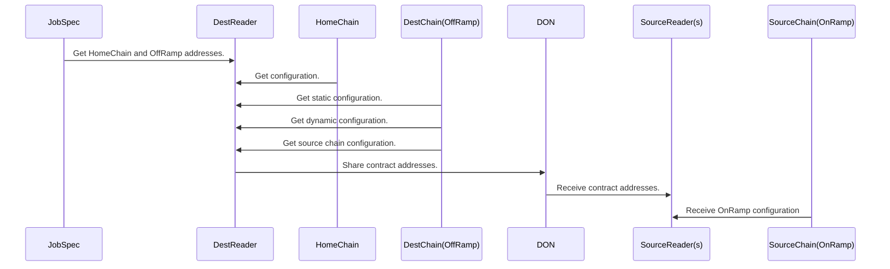

# Plugin Configuration

The OCR3 plugins have configuration is optimized to reduce the amount of
manual configuration required for node operators, and reduce the amount of
configuration needed when expanding the CCIP network. A blue-green deployment
pattern is also used to facilitate configuration changes. This document
describes the high level configuration along with the discovery process used to
run the system.

## Configuration Locations

Outline of the different locations where configuration is stored.

### Chainlink Node Job Specification

The Job Specification (jobspec) is per-node configuration. Updating this
requires coordination with node operators, so configurations are kept to a
minimum.

**Data structure references**:

* TODO: link to repo

Example configuration:

```go
TODO: configuration here.
```

### Home Chain

This is a global location readable by all nodes which are part of the
Distributed Oracle Network (DON). A bare minimum of configuration required to
bootstrap the network are stored here in order to reduce the number of updates
needed when expanding the CCIP network.

Configuration includes per-chain configuration as well as DON participant
addresses.

**Data structure references**:

* TODO: link to repo

Example configuration:

```go
TODO: configuration here.
```

### OffRamp

The OffRamp is a contract on the destination chain which, among other things,
contains many different types of configuration.

**Data structure references**:

* TODO: link to repo

Example configuration:

```go
TODO: configuration here.
```

### OnRamp

TODO: what configuration is stored here?

**Data structure references**:

* TODO: link to repo

Example configuration:

```go
TODO: configuration here.
```

## Discovery

There is no guarantee that all participants are able to read configuration from
all chains. For example the OffRamp is only available to nodes configured with
an OffRamp reader role. See the [consensus documentation](consensus.md) for
details about participant roles.

TODO: more details about discovery and a link to the discovery processor.



## Configuration Updates

TODO: describe a couple scenarios and which configuration changes.
