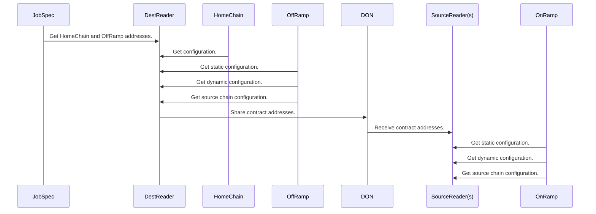

# Plugin Configuration

The OCR3 plugins have configuration is optimized to reduce the amount of
manual configuration required for node operators, and reduce the amount of
configuration needed when expanding the CCIP network. A blue-green deployment
pattern is also used to facilitate configuration changes. This document
describes the high level configuration along with the discovery process used to
run the system.

## Configuration Locations

Outline of the different locations where configuration is stored.

### Chainlink Node Job Specification

The Job Specification (jobspec) is per-node configuration. Updating this
requires coordination with node operators, so configurations are kept to a
minimum.

See the factory function inputs.

**Data structure references**:

* [NewPluginOracleCreator](https://github.com/smartcontractkit/chainlink/blob/1b41e69cca2f4622d367ef18733c36fcae433505/core/capabilities/ccip/oraclecreator/plugin.go#L77)

### Home Chain

This is a global location readable by all nodes which are part of the
Distributed Oracle Network (DON). A bare minimum of configuration required to
bootstrap the network are stored here in order to reduce the number of updates
needed when expanding the CCIP network.

Configuration includes per-chain configuration as well as DON participant
addresses.

**Data structure references**:

* [CCIPConfig](https://github.com/smartcontractkit/chainlink/blob/1b41e69cca2f4622d367ef18733c36fcae433505/contracts/src/v0.8/ccip/capability/libraries/CCIPConfigTypes.sol)

### OffRamp

The OffRamp is a contract on the destination chain which, among other things,
contains many different bits of configuration needed to configure the plugins.

**Data structure references**:

* [OffRamp structs](https://github.com/smartcontractkit/chainlink/blob/1b41e69cca2f4622d367ef18733c36fcae433505/contracts/src/v0.8/ccip/offRamp/OffRamp.sol#L89)
```
  struct StaticConfig {
    uint64 chainSelector; // ───╮  Destination chainSelector
    IRMNV2 rmn; // ─────────────╯  RMN Verification Contract
    address tokenAdminRegistry; // Token admin registry address
    address nonceManager; // Nonce manager address
  }

  /// @notice Per-chain source config (defining a lane from a Source Chain -> Dest OffRamp)
  struct SourceChainConfig {
    IRouter router; // ──────────╮  Local router to use for messages coming from this source chain
    bool isEnabled; //           |  Flag whether the source chain is enabled or not
    uint64 minSeqNr; // ─────────╯  The min sequence number expected for future messages
    bytes onRamp; // OnRamp address on the source chain
  }

  /// @notice Dynamic offRamp config
  /// @dev Since DynamicConfig is part of DynamicConfigSet event, if changing it, we should update the ABI on Atlas
  struct DynamicConfig {
    address feeQuoter; // ──────────────────────────────╮ FeeQuoter address on the local chain
    uint32 permissionLessExecutionThresholdSeconds; //  │ Waiting time before manual execution is enabled
    uint32 maxTokenTransferGas; //                      │ Maximum amount of gas passed on to token `transfer` call
    uint32 maxPoolReleaseOrMintGas; // ─────────────────╯ Maximum amount of gas passed on to token pool when calling releaseOrMint
    address messageValidator; // Optional message validator to validate incoming messages (zero address = no validator)
  }
```

### OnRamp

The OnRamp's are discovered from the OffRamp `SoureChainConfig` data and are
used by the plugins to discover source chain FeeQuoter and Router addresses.

**Data structure references**:

* [OnRamp structs](https://github.com/smartcontractkit/chainlink/blob/develop/contracts/src/v0.8/ccip/onRamp/OnRamp.sol)
```
  /// @dev Struct that contains the static configuration
  /// RMN depends on this struct, if changing, please notify the RMN maintainers.
  // solhint-disable-next-line gas-struct-packing
  struct StaticConfig {
    uint64 chainSelector; // ─────╮ Source chain selector
    IRMNV2 rmn; // ───────────────╯ RMN remote address
    address nonceManager; // Nonce manager address
    address tokenAdminRegistry; // Token admin registry address
  }

  /// @dev Struct that contains the dynamic configuration
  // solhint-disable-next-line gas-struct-packing
  struct DynamicConfig {
    address feeQuoter; // FeeQuoter address
    address messageValidator; // Optional message validator to validate outbound messages (zero address = no validator)
    address feeAggregator; // Fee aggregator address
    address allowListAdmin; // authorized admin to add or remove allowed senders
  }

  /// @dev Struct to hold the configs for a destination chain
  /// @dev sequenceNumber, allowListEnabled, router will all be packed in 1 slot
  struct DestChainConfig {
    // The last used sequence number. This is zero in the case where no messages have yet been sent.
    // 0 is not a valid sequence number for any real transaction.
    uint64 sequenceNumber; // ──────╮ The last used sequence number
    bool allowListEnabled; //       │ boolean indicator to specify if allowList check is enabled
    IRouter router; // ─────────────╯ Local router address  that is allowed to send messages to the destination chain.
    // This is the list of addresses allowed to send messages from onRamp
    EnumerableSet.AddressSet allowedSendersList;
  }
```

## Discovery

There is no guarantee that all participants are able to read configuration from
all chains. For example the OffRamp is only available to nodes configured with
an OffRamp reader role. See the [consensus documentation](consensus.md) for
details about participant roles.

TODO: more details about discovery and a link to the discovery processor.


