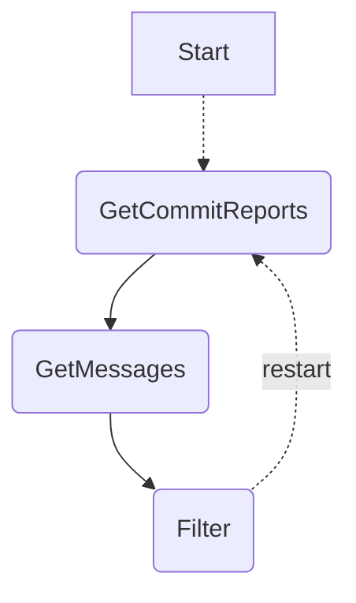

# Execute Plugin

The execute plugin observes the destination chain for pending commit reports
and manages their execution. The data required is spread across source and
destination chains, so the process takes multiple rounds of consensus before
any given commit can be executed.

## Execute Plugin Design

The plugin is implemented as a state machine, and moves from state to state
each round. There are 3 main states:
1. `GetCommitReports`: The single destination chain is observed for commit
   reports containing messages that need to be executed.
2. `GetMessages`: Source chains are observed for messages that are part of the
    commit reports.
3. `Filter`: The single destination chain is observed for final details
   required to filter out any messages that are not yet eligible for execution.
   Such as the sender nonce for ordered execution.

# OCR Data

Overview of the data expected for each plugin state and stage of OCR.

## GetCommitReports
### Observation

Chain discovery observations.

CommitData for reports from the destination chain. The following fields
are empty:
* Messages
* TokenData

### Outcome

The observed CommitData from the observation phase.

## GetMessages
### Observation

Chain discovery observations.

CommitData from the previous outcome.
Messages from the source chains.
TokenData from external attestation services (i.e. CCTP).

### Outcome

Chain discovery observations.

CommitData populated with all Messages and TokenData.

## Filter
### Observation

Chain discovery observations.

Nonce observations.

### Outcome

CommitData from previous outcome for any that are not being fully executed.
Reports to execute as many messages as possible.
