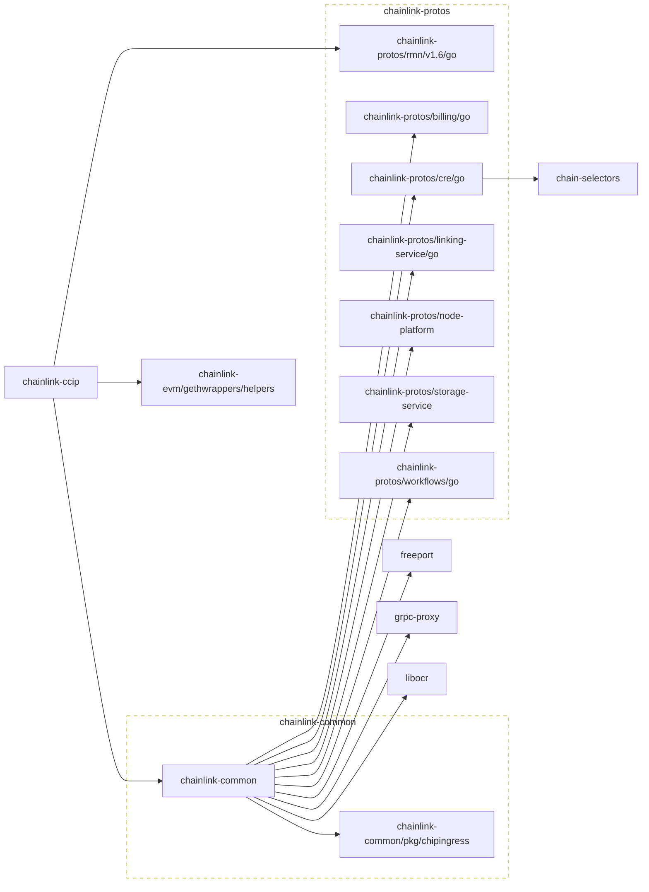

# smartcontractkit Go modules
## Main module

```mermaid
flowchart LR

	chain-selectors
	click chain-selectors href "https://github.com/smartcontractkit/chain-selectors"
	chainlink-ccip --> chainlink-common
	chainlink-ccip --> chainlink-evm/gethwrappers/helpers
	chainlink-ccip --> chainlink-protos/rmn/v1.6/go
	click chainlink-ccip href "https://github.com/smartcontractkit/chainlink-ccip"
	chainlink-common --> chainlink-common/pkg/chipingress
	chainlink-common --> chainlink-protos/billing/go
	chainlink-common --> chainlink-protos/cre/go
	chainlink-common --> chainlink-protos/linking-service/go
	chainlink-common --> chainlink-protos/node-platform
	chainlink-common --> chainlink-protos/storage-service
	chainlink-common --> chainlink-protos/workflows/go
	chainlink-common --> freeport
	chainlink-common --> grpc-proxy
	chainlink-common --> libocr
	click chainlink-common href "https://github.com/smartcontractkit/chainlink-common"
	chainlink-common/pkg/chipingress
	click chainlink-common/pkg/chipingress href "https://github.com/smartcontractkit/chainlink-common"
	chainlink-evm/gethwrappers/helpers
	click chainlink-evm/gethwrappers/helpers href "https://github.com/smartcontractkit/chainlink-evm"
	chainlink-protos/billing/go
	click chainlink-protos/billing/go href "https://github.com/smartcontractkit/chainlink-protos"
	chainlink-protos/cre/go --> chain-selectors
	click chainlink-protos/cre/go href "https://github.com/smartcontractkit/chainlink-protos"
	chainlink-protos/linking-service/go
	click chainlink-protos/linking-service/go href "https://github.com/smartcontractkit/chainlink-protos"
	chainlink-protos/node-platform
	click chainlink-protos/node-platform href "https://github.com/smartcontractkit/chainlink-protos"
	chainlink-protos/rmn/v1.6/go
	click chainlink-protos/rmn/v1.6/go href "https://github.com/smartcontractkit/chainlink-protos"
	chainlink-protos/storage-service
	click chainlink-protos/storage-service href "https://github.com/smartcontractkit/chainlink-protos"
	chainlink-protos/workflows/go
	click chainlink-protos/workflows/go href "https://github.com/smartcontractkit/chainlink-protos"
	freeport
	click freeport href "https://github.com/smartcontractkit/freeport"
	grpc-proxy
	click grpc-proxy href "https://github.com/smartcontractkit/grpc-proxy"
	libocr
	click libocr href "https://github.com/smartcontractkit/libocr"

	subgraph chainlink-common-repo[chainlink-common]
		 chainlink-common
		 chainlink-common/pkg/chipingress
	end
	click chainlink-common-repo href "https://github.com/smartcontractkit/chainlink-common"

	subgraph chainlink-protos-repo[chainlink-protos]
		 chainlink-protos/billing/go
		 chainlink-protos/cre/go
		 chainlink-protos/linking-service/go
		 chainlink-protos/node-platform
		 chainlink-protos/rmn/v1.6/go
		 chainlink-protos/storage-service
		 chainlink-protos/workflows/go
	end
	click chainlink-protos-repo href "https://github.com/smartcontractkit/chainlink-protos"

	classDef outline stroke-dasharray:6,fill:none;
	class chainlink-common-repo,chainlink-protos-repo outline
```
## All modules
```mermaid
flowchart LR

