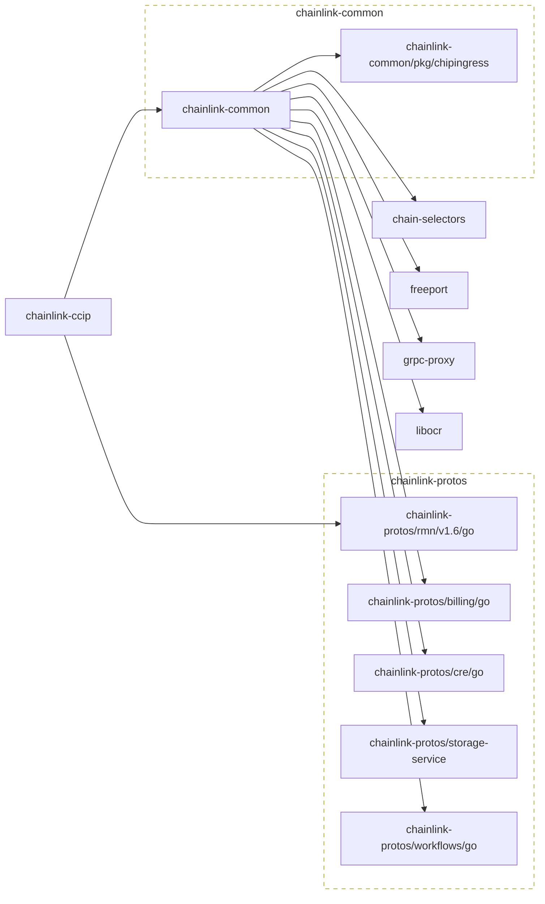

# smartcontractkit Go modules
## Main module

```mermaid
flowchart LR

	chain-selectors
	click chain-selectors href "https://github.com/smartcontractkit/chain-selectors"
	chainlink-ccip --> chainlink-common
	chainlink-ccip --> chainlink-protos/rmn/v1.6/go
	click chainlink-ccip href "https://github.com/smartcontractkit/chainlink-ccip"
	chainlink-common --> chain-selectors
	chainlink-common --> chainlink-common/pkg/chipingress
	chainlink-common --> chainlink-protos/billing/go
	chainlink-common --> chainlink-protos/cre/go
	chainlink-common --> chainlink-protos/storage-service
	chainlink-common --> chainlink-protos/workflows/go
	chainlink-common --> freeport
	chainlink-common --> grpc-proxy
	chainlink-common --> libocr
	click chainlink-common href "https://github.com/smartcontractkit/chainlink-common"
	chainlink-common/pkg/chipingress
	click chainlink-common/pkg/chipingress href "https://github.com/smartcontractkit/chainlink-common"
	chainlink-protos/billing/go
	click chainlink-protos/billing/go href "https://github.com/smartcontractkit/chainlink-protos"
	chainlink-protos/cre/go
	click chainlink-protos/cre/go href "https://github.com/smartcontractkit/chainlink-protos"
	chainlink-protos/rmn/v1.6/go
	click chainlink-protos/rmn/v1.6/go href "https://github.com/smartcontractkit/chainlink-protos"
	chainlink-protos/storage-service
	click chainlink-protos/storage-service href "https://github.com/smartcontractkit/chainlink-protos"
	chainlink-protos/workflows/go
	click chainlink-protos/workflows/go href "https://github.com/smartcontractkit/chainlink-protos"
	freeport
	click freeport href "https://github.com/smartcontractkit/freeport"
	grpc-proxy
	click grpc-proxy href "https://github.com/smartcontractkit/grpc-proxy"
	libocr
	click libocr href "https://github.com/smartcontractkit/libocr"

	subgraph chainlink-common-repo[chainlink-common]
		 chainlink-common
		 chainlink-common/pkg/chipingress
	end
	click chainlink-common-repo href "https://github.com/smartcontractkit/chainlink-common"

	subgraph chainlink-protos-repo[chainlink-protos]
		 chainlink-protos/billing/go
		 chainlink-protos/cre/go
		 chainlink-protos/rmn/v1.6/go
		 chainlink-protos/storage-service
		 chainlink-protos/workflows/go
	end
	click chainlink-protos-repo href "https://github.com/smartcontractkit/chainlink-protos"

	classDef outline stroke-dasharray:6,fill:none;
	class chainlink-common-repo,chainlink-protos-repo outline
```
## All modules

```mermaid
flowchart LR

	ccip-owner-contracts
	click ccip-owner-contracts href "https://github.com/smartcontractkit/ccip-owner-contracts"
	chain-selectors
	click chain-selectors href "https://github.com/smartcontractkit/chain-selectors"
	chainlink-aptos --> chainlink-common
	click chainlink-aptos href "https://github.com/smartcontractkit/chainlink-aptos"
	chainlink-ccip --> chainlink-common
	chainlink-ccip --> chainlink-protos/rmn/v1.6/go
	click chainlink-ccip href "https://github.com/smartcontractkit/chainlink-ccip"
	chainlink-ccip/chains/evm/deployment --> chainlink-ccip/deployment
	chainlink-ccip/chains/evm/deployment --> chainlink-evm/gethwrappers
	click chainlink-ccip/chains/evm/deployment href "https://github.com/smartcontractkit/chainlink-ccip"
	chainlink-ccip/chains/solana --> chainlink-ccip
	chainlink-ccip/chains/solana --> chainlink-ccip/chains/solana/gobindings
	click chainlink-ccip/chains/solana href "https://github.com/smartcontractkit/chainlink-ccip"
	chainlink-ccip/chains/solana/deployment --> chainlink-ccip/chains/evm/deployment
	click chainlink-ccip/chains/solana/deployment href "https://github.com/smartcontractkit/chainlink-ccip"
	chainlink-ccip/chains/solana/gobindings
	click chainlink-ccip/chains/solana/gobindings href "https://github.com/smartcontractkit/chainlink-ccip"
	chainlink-ccip/cmd/carpenter --> chainlink-ccip
	click chainlink-ccip/cmd/carpenter href "https://github.com/smartcontractkit/chainlink-ccip"
	chainlink-ccip/deployment --> chainlink-deployments-framework
	click chainlink-ccip/deployment href "https://github.com/smartcontractkit/chainlink-ccip"
	chainlink-common --> chain-selectors
	chainlink-common --> chainlink-common/pkg/chipingress
	chainlink-common --> chainlink-protos/billing/go
	chainlink-common --> chainlink-protos/cre/go
	chainlink-common --> chainlink-protos/storage-service
	chainlink-common --> chainlink-protos/workflows/go
	chainlink-common --> freeport
	chainlink-common --> grpc-proxy
	chainlink-common --> libocr
	click chainlink-common href "https://github.com/smartcontractkit/chainlink-common"
	chainlink-common/pkg/chipingress
	click chainlink-common/pkg/chipingress href "https://github.com/smartcontractkit/chainlink-common"
	chainlink-common/pkg/values
	click chainlink-common/pkg/values href "https://github.com/smartcontractkit/chainlink-common"
	chainlink-deployments-framework --> ccip-owner-contracts
	chainlink-deployments-framework --> chainlink-protos/job-distributor
	chainlink-deployments-framework --> chainlink-protos/op-catalog
	chainlink-deployments-framework --> chainlink-testing-framework/seth
	chainlink-deployments-framework --> chainlink-tron/relayer
	chainlink-deployments-framework --> mcms
	click chainlink-deployments-framework href "https://github.com/smartcontractkit/chainlink-deployments-framework"
	chainlink-evm/gethwrappers
	click chainlink-evm/gethwrappers href "https://github.com/smartcontractkit/chainlink-evm"
	chainlink-protos/billing/go
	click chainlink-protos/billing/go href "https://github.com/smartcontractkit/chainlink-protos"
	chainlink-protos/cre/go
	click chainlink-protos/cre/go href "https://github.com/smartcontractkit/chainlink-protos"
	chainlink-protos/job-distributor
	click chainlink-protos/job-distributor href "https://github.com/smartcontractkit/chainlink-protos"
	chainlink-protos/op-catalog
	click chainlink-protos/op-catalog href "https://github.com/smartcontractkit/chainlink-protos"
	chainlink-protos/rmn/v1.6/go
	click chainlink-protos/rmn/v1.6/go href "https://github.com/smartcontractkit/chainlink-protos"
	chainlink-protos/storage-service
	click chainlink-protos/storage-service href "https://github.com/smartcontractkit/chainlink-protos"
	chainlink-protos/workflows/go
	click chainlink-protos/workflows/go href "https://github.com/smartcontractkit/chainlink-protos"
	chainlink-sui --> chainlink-aptos
	chainlink-sui --> chainlink-ccip
	chainlink-sui --> chainlink-common/pkg/values
	click chainlink-sui href "https://github.com/smartcontractkit/chainlink-sui"
	chainlink-testing-framework/framework
	click chainlink-testing-framework/framework href "https://github.com/smartcontractkit/chainlink-testing-framework"
	chainlink-testing-framework/seth
	click chainlink-testing-framework/seth href "https://github.com/smartcontractkit/chainlink-testing-framework"
	chainlink-tron/relayer --> chainlink-common
	chainlink-tron/relayer --> chainlink-common/pkg/values
	click chainlink-tron/relayer href "https://github.com/smartcontractkit/chainlink-tron"
	freeport
	click freeport href "https://github.com/smartcontractkit/freeport"
	grpc-proxy
	click grpc-proxy href "https://github.com/smartcontractkit/grpc-proxy"
	libocr
	click libocr href "https://github.com/smartcontractkit/libocr"
	mcms --> chainlink-ccip/chains/solana
	mcms --> chainlink-sui
	mcms --> chainlink-testing-framework/framework
	click mcms href "https://github.com/smartcontractkit/mcms"

	subgraph chainlink-ccip-repo[chainlink-ccip]
		 chainlink-ccip
		 chainlink-ccip/chains/evm/deployment
		 chainlink-ccip/chains/solana
		 chainlink-ccip/chains/solana/deployment
		 chainlink-ccip/chains/solana/gobindings
		 chainlink-ccip/cmd/carpenter
		 chainlink-ccip/deployment
	end
	click chainlink-ccip-repo href "https://github.com/smartcontractkit/chainlink-ccip"

	subgraph chainlink-common-repo[chainlink-common]
		 chainlink-common
		 chainlink-common/pkg/chipingress
		 chainlink-common/pkg/values
	end
	click chainlink-common-repo href "https://github.com/smartcontractkit/chainlink-common"

	subgraph chainlink-protos-repo[chainlink-protos]
		 chainlink-protos/billing/go
		 chainlink-protos/cre/go
		 chainlink-protos/job-distributor
		 chainlink-protos/op-catalog
		 chainlink-protos/rmn/v1.6/go
		 chainlink-protos/storage-service
		 chainlink-protos/workflows/go
	end
	click chainlink-protos-repo href "https://github.com/smartcontractkit/chainlink-protos"

	subgraph chainlink-testing-framework-repo[chainlink-testing-framework]
		 chainlink-testing-framework/framework
		 chainlink-testing-framework/seth
	end
	click chainlink-testing-framework-repo href "https://github.com/smartcontractkit/chainlink-testing-framework"

	classDef outline stroke-dasharray:6,fill:none;
	class chainlink-ccip-repo,chainlink-common-repo,chainlink-protos-repo,chainlink-testing-framework-repo outline
```
