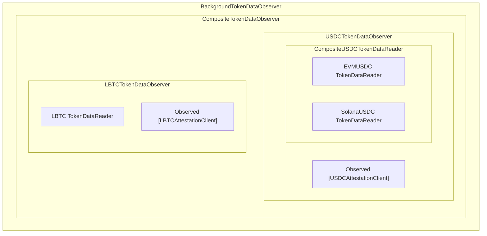

# Token Data Observer

This package implements an observer for fetching token data from offchain locations. The primary use case for this data is 3rd party attestation services (CCTP/USDC, LBTC), but in theory it could be used to fetch any token data for unknown use cases.

The observer provides two primary functions:
* Observe(ctx, messages) (observations, error)
* IsTokenSupported(sourceSelector, msgTokenTransfer) bool

The OCR plugin simply calls **Observe** and includes token data in the final report as necessary.

# Architecture

The **TokenDataObserver** is built by composing many parts which all implement the same two interfaces:
* **TokenDataObserver**
* **AttestionClient**

We'll go into detail on each of these components, but first, here is a diagram which shows how everything is assembled for the **Execute** plugin:

## Composite Token Data Observer

In order to support multiple token types, a special **compositeTokenDataObserver** exists to dispatch calls to token specific Observers. At a high level it holds a slice of **TokenDataObserver** objects and calls **Observe** on each of them. Results from all observers are merged together to return a single response.

Configuration for which tokens are supported is done using data stored in the **Home Chain**. See **NewConfigBasedCompositeObservers** for the logic which initializes token specific observers. The actual configuration if found at **pluginconfig/token.go** in the **TokenDataObserverConfig** struct.

## Token Specific Observers

Token specific observers (USDC, LBTC) are initialized as part of the **compositeTokenDataObserver**. They implement the same **TokenDataObserver** as everything else but have token specific logic.

To add a new token, you would create a new package in this directory and implement the interface.

## Attestation Client & Metrics

The **AttestationClient** interface is a small wrapper for an http client. It is only used by the token specific observers and should have a token specific implementation. The main purpose of this interface is to be wrapped by an **ObservedAttestationClient**, which logs prometheus metrics.

## Background Processing & Caching

Data fetching happens as a background task. This is done to avoid latency introduced by calling 3rd party services. The **backgroundObserver** object implements the same **TokenDataObserver** and wraps the **compositeTokenDataObserver**. Instead of calling the real **Observe** function immediately, it manages a cache and only returns cached data. Any messages which had not been cached previously are sent to a queue where a background task will call the **Observe** function and add results to the cache. In future rounds, the data will be cached for immediate retrieval.
